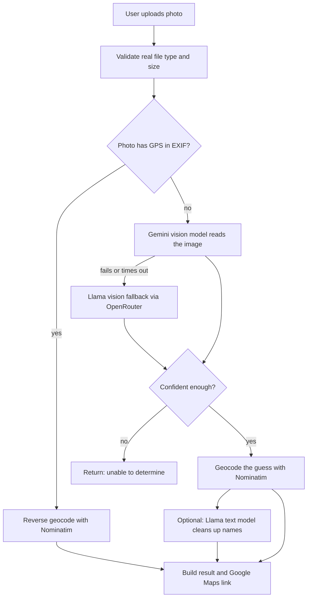

# Image Location Finder

Upload a photo, click **Find location**, and get an estimate of where it was taken:

**Country / State / City / Place name**, plus a confidence level and a button to open the place in Google Maps.

> **Status:** work in progress. The pipeline is built, but accuracy has not been measured yet and the end-to-end flow is still being verified. See [Limitations](#limitations).

<!-- Add a screenshot here:  -->

---

## What it does

- One-page website: drag and drop (or browse for) an outdoor photo.
- Returns a structured result: country, state, city and place name.
- Shows a **confidence** value and the **clues** the model used (for example "gopuram architecture, Tamil script on signage").
- Says **"unable to determine"** instead of guessing when the evidence is weak.
- Opens the result in Google Maps (no Maps API key needed).

## How it works

The backend is a Node.js (Express) server that calls each AI model directly with API keys kept in environment variables. Different models handle different tasks instead of one model doing everything.



| Step | Tool | Notes |
|---|---|---|
| GPS metadata | `exifreader` | Exact and free when present. Many apps strip it, so it often is not there. |
| Vision (main) | Google Gemini Flash | Extracts location and clues, returns JSON. |
| Vision (fallback) | Llama vision model via OpenRouter | Used only if Gemini fails. |
| Geocoding | Nominatim (OpenStreetMap) | Free, no key, about 1 request per second. |
| Merge (optional) | Llama text model via OpenRouter or Groq | Off by default (`ENABLE_MERGE=false`). |

OCR, embeddings and vector search are not part of this version. They only help if you have a reference set of geotagged photos.

## Tech stack

Node.js 20+, Express, Multer (uploads), express-rate-limit, file-type (real file type check), ExifReader, plain HTML/CSS/JavaScript frontend.

## Project structure

```
server.js            Express app and POST /locate
public/              Frontend (index.html, styles.css, app.js)
src/
  config.js          Loads and validates environment variables
  exif.js            Reads GPS from photo metadata
  vision.js          Gemini vision call with fallback
  llm.js             OpenAI-compatible calls (OpenRouter / Groq)
  geocode.js         Nominatim lookups
  merge.js           Optional merge step
  maps.js            Google Maps link builder
  utils.js           Validation and escaping helpers
test/                Unit tests (node --test)
```

## Getting started

### 1. Requirements

- Node.js 20 or newer
- A Google AI Studio API key (required)
- An OpenRouter API key (optional, for the Llama fallback)

### 2. Install

```bash
git clone https://github.com/HARI-3728/Loaction-finder-by-Image.git
cd Loaction-finder-by-Image
npm install
```

### 3. Configure

Create your own `.env` from the template. **Never commit `.env` or share your keys.**

```bash
cp .env.example .env        # Windows PowerShell: Copy-Item .env.example .env
```

Fill in at least:

```env
GEMINI_API_KEY=your_google_ai_studio_key
VISION_MODEL=gemini-3.5-flash
```

Model names change often. Check the exact ID in Google AI Studio (or the provider's model list) before using it.

### 4. Run

```bash
npm start        # or: node server.js
```

Open **http://localhost:3000**, upload a photo and click **Find location**.

### 5. Test

```bash
npm test
```

## Environment variables

| Variable | Required | Description |
|---|---|---|
| `GEMINI_API_KEY` | yes | Google AI Studio key |
| `VISION_MODEL` | yes | Gemini model ID for image analysis |
| `VISION_TIMEOUT_MS` | no | Timeout for vision calls (default 20000) |
| `OPENROUTER_API_KEY` | no | Key for the Llama fallback and merge step |
| `VISION_FALLBACK_MODEL` | no | Llama vision model slug on OpenRouter |
| `ENABLE_MERGE` | no | `true` to enable the merge step (default `false`) |
| `MERGE_PROVIDER` | no | `openrouter` or `groq` |
| `MERGE_MODEL` | no | Text model used by the merge step |
| `GROQ_API_KEY` | no | Only if the merge provider is Groq |
| `GEOCODER_USER_AGENT` | no | User-Agent sent to Nominatim |
| `GEOCODER_RATE_LIMIT_MS` | no | Delay between geocoder calls (default 1000) |
| `USE_EXIF_GPS` | no | Try photo GPS first (default `true`) |
| `CONFIDENCE_THRESHOLD` | no | Below this, answer "unable to determine" (default 0.4) |
| `MAX_UPLOAD_MB` | no | Upload size limit (default 10) |
| `ALLOWED_IMAGE_TYPES` | no | Default `image/jpeg,image/png,image/webp` |
| `RATE_LIMIT_WINDOW_MS` | no | Rate-limit window for `/locate` (default 60000) |
| `RATE_LIMIT_MAX` | no | Requests per window per IP (default 10) |
| `APP_PORT` | no | Server port (default 3000) |

## API

### `POST /locate`

Multipart form data, field name `image` (JPEG, PNG or WebP).

```bash
curl -F "image=@photo.jpg" http://localhost:3000/locate
```

Success:

```json
{
  "status": "ok",
  "country": "India",
  "state": "Tamil Nadu",
  "city": "Madurai",
  "place_name": "Meenakshi Amman Temple",
  "confidence": 0.9,
  "source": "ai",
  "clues": ["gopuram architecture", "Tamil script on signage"],
  "coordinates": { "lat": 9.9195, "lon": 78.1193 },
  "maps_url": "https://www.google.com/maps/search/?api=1&query=..."
}
```

Not enough evidence:

```json
{
  "status": "undetermined",
  "message": "Unable to determine the location from this image.",
  "confidence": 0.12,
  "clues": []
}
```

Errors: `400` no file, `413` file too large, `415` unsupported type, `429` too many requests, `502` vision service unavailable. Each returns `{ "error": "..." }`.

### `GET /health`

Returns `{ "status": "ok", "timestamp": "..." }`.

## Limitations

- **Precision drops as the answer gets more specific.** Country level is much easier than city or exact place. Exact-place accuracy is realistic mainly for famous landmarks.
- **Generic scenes are hard** (forests, beaches, plain roads) and will often return "unable to determine".
- **Models can be confidently wrong.** Confidence comes from the model and is not a guarantee. Treat results as leads to verify, not proof.
- **Accuracy has not been measured yet.** The 70-80% goal is a target, not a result.
- **Photo GPS is often missing** because many apps strip it.
- **Free-tier limits** from AI providers can change and can cause rate-limit errors.
- **Nominatim** allows roughly one request per second and may not find every place.
- Works best on **outdoor photos**. Indoor photos, screenshots and heavily edited images are unlikely to work.

## Privacy and responsible use

- Uploaded photos are processed in memory and sent to third-party AI services (Google, and OpenRouter if the fallback is used). Do not upload photos you are not comfortable sharing with those providers.
- API keys stay on the server and are never sent to the browser.
- Do not use this tool to find where a private person lives or is staying.

## Roadmap

- Measure accuracy on a labeled photo set (country, state and city level)
- Loading and "unable to determine" screens polished in the UI
- Optional OCR for sign text
- Optional embeddings and vector search over a reference set of geotagged places

## Contributing

Issues and pull requests are welcome. Please do not commit `.env` files or API keys.

## License

Add a license file (for example MIT) before publishing.
